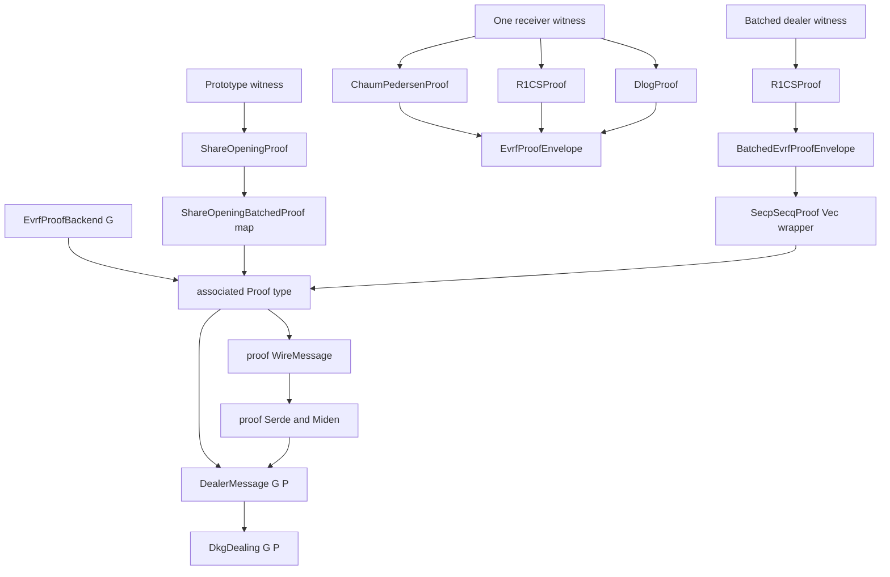
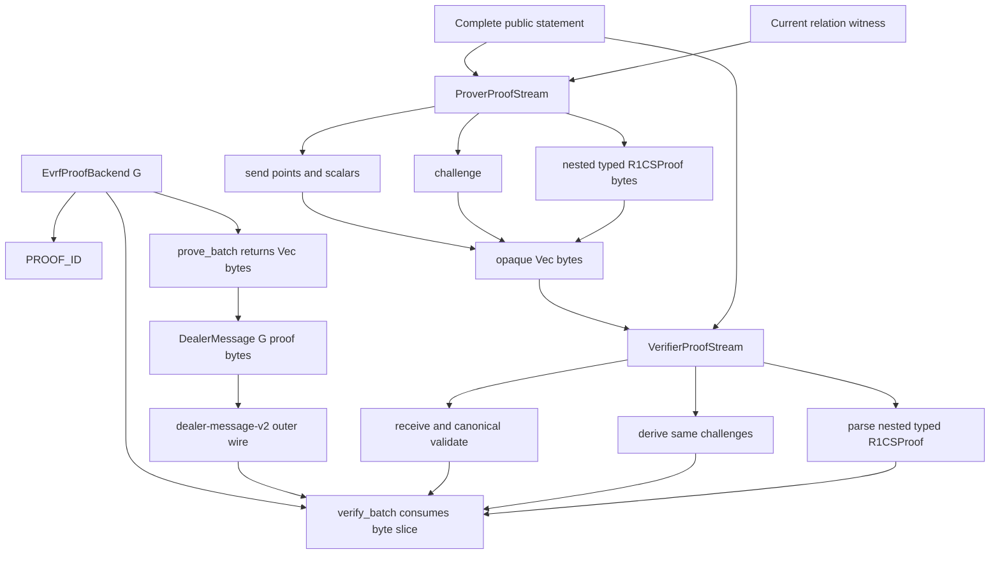

# Golden proof-stream cleanup research synthesis

## Recommendation

Keep the current configurable Golden DKG and `EvrfProofBackend<G>` seam, but remove its associated proof type and every Golden-level proof container. Backends produce opaque `Vec<u8>` streams and verify borrowed byte slices. Paired, crate-private, curve-aware prover/verifier roles own canonical point/scalar parsing, transcript observations, messages, challenges, nested child framing, and exact completion.

Migrate all Golden proof paths—prototype, standalone one-receiver paper proof, and batched dealer paper proof—to one shared-transcript stream model. Keep the current typed `bulletproofs_cycle::R1CSProof` as a nested backend-private intermediate. Do not change Bulletproofs internals, Golden mathematical relations, DKG lifecycle, output roots, or EHTDH production semantics.

---

# 1. Current and target object flow

## 1.1 Current proof flow



`EvrfProofBackend::Proof` is declared in `crates/golden-core/src/dkg.rs:231-277`. It propagates into stored messages/dealings and every DKG function signature (`dkg.rs:291-319, 334-685`). The outer dealer wire delegates proof framing and context to `P: WireMessage` (`crates/golden-core/src/wire.rs:440-521`).

The prototype exposes per-receiver and batched proof structs plus standalone wire/Serde/Miden adapters (`crates/golden-evrf/src/lib.rs:39-248`). The paper module exposes standalone CP/DLOG/R1CS envelopes, a batched R1CS envelope, and a public `SecpSecqProof(Vec<u8>)` transport wrapper (`crates/golden-evrf/src/paper.rs:113-222, 1902-2026`).

## 1.2 Target proof flow



The proof stream is the Golden envelope. It is not itself a public domain value: `DealerMessage<G>` stores raw opaque bytes, and the selected backend interprets them only during statement-aware verification.

---

# 2. Focused source vocabulary

| Term | Meaning in this PR |
|---|---|
| Proof stream | Ordered opaque prover-message bytes plus an identically reconstructed transcript; labels, public observations, and challenges are not serialized. |
| Prover stream | Owns output bytes and Merlin transcript; sends canonical curve values and derives challenges. |
| Verifier stream | Borrows proof bytes and owns the matching Merlin transcript/cursor; receives and validates canonical curve values and rejects trailing bytes. |
| Public observation | Statement data independently known by prover and verifier, appended to the transcript but omitted from proof bytes. |
| Sent/received message | Prover-supplied proof data that is serialized and appended to the transcript exactly once after successful parsing. |
| Challenge | Fiat–Shamir output determined by proof ID, complete public observations, and all preceding accepted messages. |
| Nested proof | A child protocol that receives the same transcript and returns/consumes a length-framed payload; raw child bytes are not re-observed because the child observes its semantic messages. |
| Proof ID | Stable versioned grammar and transcript-domain identifier at the beginning of every proof stream. |
| Golden proof type | Any typed CP, DLOG, prototype, batch, or byte-wrapper value that exists primarily to group/serialize proof messages; removed by this PR. |
| Typed R1CS proof | Current `R1CSProof` inside `bulletproofs-cycle`; deliberately retained as the one nested intermediate until a later proof-engine migration. |

The stream follows Merlin’s transcript model: domain separation, fixed labels, canonical encodings, and sequential composition through one transcript (`merlin-transcript-protocol`, p. 1). Challenge ordering matters for multi-round Fiat–Shamir composition (`2023-ganesh-et-al-fiat-shamir-bulletproofs-nonmalleable`, PDF pp. 15–16).

---

# 3. Type inventory and verdicts

| Path / symbol | Actual callers | Responsibility | Verdict | Exact recommendation |
|---|---|---|---|---|
| `golden-core/dkg.rs:EvrfProofBackend<G>` | Core DKG operations; fake/prototype/paper implementations | Curve-configurable pad/prove/verify seam | **KEEP / RESHAPE** | Keep trait; add versioned `PROOF_ID`; remove associated `Proof`; return `Vec<u8>` and verify `&[u8]`. |
| `golden-core/dkg.rs:EvrfProofBackend::Proof` | Stored DKG types, wire, every backend | Associated transport/proof representation | **REMOVE** | Opaque bytes are the only backend output. |
| `golden-core/dkg.rs:EvrfStatement<G>` | Core construction/verification; prototype/paper backends | Current public proof statement | **KEEP** | Current relation is out of scope; stream observes its canonical public values/root. |
| `golden-core/dkg.rs:EvrfWitness<G>` | Core creation; prototype/paper backends | Current proof witness | **KEEP** | Current relation is out of scope. |
| `golden-core/dkg.rs:DealerMessage<G,P>` | Wire, verify, complete, integrations | Broadcast parameterized by proof representation | **RESHAPE** | `DealerMessage<G>` with `proof: Vec<u8>`; no backend/proof generic or separate proof-ID field. |
| `golden-core/dkg.rs:DkgDealing<G,P>` | Creation, completion, tests | Public message + local share | **RESHAPE** | `DkgDealing<G>`; behavior unchanged. |
| `golden-core` fake proof structs | Core tests | Test-associated proof representations | **REMOVE** | Encode canonical fake proof bytes through the stream/test helpers. |
| `golden-evrf/lib.rs:ShareOpeningProof<G>` | Prototype backend/tests | Per-receiver proof message group | **REMOVE** | Send/receive nonce points and response scalars directly. |
| `golden-evrf/lib.rs:ShareOpeningBatchedProof<G>` | Prototype backend, wire/Serde/Miden/tests | Receiver-indexed proof map | **REMOVE** | Canonical statement order defines proof order; stream `finish` rejects omissions/extras. |
| `golden-evrf/lib.rs:ShareOpeningBackend` | Prototype DKG/EHTDH tests | Current prototype relation adapter | **KEEP / RESHAPE** | Same equations; stream v2 grammar/challenges; byte backend interface. |
| `paper.rs:ChaumPedersenProof` | Standalone one-receiver envelope | CP nonce/response container | **REMOVE** | Private algebra sends/receives CP points/scalar directly. |
| `paper.rs:DlogProof` | Standalone one-receiver envelope | DLOG nonce/response container | **REMOVE as representation** | Keep private equations/helpers; stream fields directly. |
| `paper.rs:EvrfProofEnvelope` | Standalone prove/verify/tests | CP + R1CS prefixes/proof + DLOG grouping | **REMOVE** | One-receiver proof stream is the envelope. |
| `paper.rs:BatchedEvrfProofEnvelope` | Batched dealer prove/verify/encoding | One-field R1CS wrapper | **REMOVE** | Nested R1CS frame is written/read directly. |
| `paper.rs:SecpSecqProof(pub Vec<u8>)` | DKG message type, wire/Serde/Miden/tests | Public opaque byte wrapper | **REMOVE** | `DealerMessage<G>::proof` owns bytes; backend parses stream. |
| `paper.rs:R1CSProof<R1csCycle>` | One-receiver/batched paper implementation | Typed nested Bulletproofs proof | **KEEP private** | Serialize into nested stream frame; parse and verify with unchanged engine. |
| `bulletproofs-cycle:InnerProductProof` | R1CS proof implementation | Typed nested IPP proof | **KEEP unchanged** | Later proof-engine migration only. |
| `golden-core/wire.rs:WireMessage for proof types` | Standalone proof transport/tests | Independent proof codecs/tags | **REMOVE** | Dealer-message-v2 is the sole proof transport seam. |
| `golden-core/wire.rs:WireMessage for Vec<u8>` | No demonstrated non-proof consumer | Standalone opaque proof bytes | **REMOVE if unused** | Keep only private length helpers for the dealer proof field. |
| Proof-specific Serde visitors/Miden adapters | Standalone proof tests/callers | Alternate proof persistence paths | **REMOVE** | Outer dealer-message adapters own serialized proof bytes. |
| `golden-ehtdh1` production bridge/material types | Production EHTDH flow | Consume completed DKG output | **KEEP unchanged** | Proof representations do not cross this seam. |
| EHTDH integration-test proof aliases | Bridge tests | Type plumbing only | **REMOVE/RESHAPE** | Use `DealerMessage<G>` and `DkgDealing<G>` directly. |

---

# 4. Duplicate representations and conversion chains removed

## Prototype

```text
nonce/response values
    -> ShareOpeningProof
    -> BTreeMap<receiver, ShareOpeningProof>
    -> ShareOpeningBatchedProof
    -> WireMessage
    -> DealerMessage proof field
```

becomes:

```text
nonce/response values
    -> ProverProofStream send_point/send_scalar
    -> Vec<u8>
```

## One receiver

```text
CP values -> ChaumPedersenProof
R1CS prefixes + typed proof
DLOG values -> DlogProof
all -> EvrfProofEnvelope
```

becomes one ordered stream sharing one transcript.

## Batched dealer

```text
R1CSProof
    -> BatchedEvrfProofEnvelope
    -> encode_proof
    -> SecpSecqProof(Vec<u8>)
    -> proof WireMessage/Serde/Miden
    -> DealerMessage<G,P>
```

becomes:

```text
R1CSProof::to_bytes
    -> nested ProverProofStream frame
    -> DealerMessage<G>::proof
```

## DKG generic propagation

```text
B::Proof
    -> DkgDealing<G,B::Proof>
    -> DealerMessage<G,B::Proof>
    -> maps/helpers/complete/wire/test aliases
```

becomes proof-independent stored DKG values while `B` remains on operations that actually prove/verify/derive pads.

---

# 5. Recommended curve-aware stream interface

The stream belongs crate-private in `golden-evrf`, not in proof-system-agnostic `golden-core`.

```rust
pub(crate) enum IdentityPolicy {
    Allow,
    Reject,
}

pub(crate) trait ProofStreamCurve {
    type Point;
    type Scalar;

    const POINT_BYTES: usize;
    const SCALAR_BYTES: usize;

    fn encode_point(point: &Self::Point) -> Vec<u8>;
    fn decode_point(bytes: &[u8]) -> Result<Self::Point, ProofStreamError>;
    fn is_identity(point: &Self::Point) -> bool;

    fn encode_scalar(scalar: &Self::Scalar) -> Vec<u8>;
    fn decode_scalar(bytes: &[u8]) -> Result<Self::Scalar, ProofStreamError>;
}
```

Private adapters bridge current abstractions:

- `GoldenCurve<G: GoldenGroup>` for generic prototype curves;
- `CycleCurve<C: bulletproofs_cycle::Cycle>` for Secp/Secq paper values.

Decoding must be strict and canonical: exact fixed width, successful decode, re-encode equality, canonical scalars only, and explicit identity policy.

A shared observation trait prevents prover/verifier statement-binding drift:

```rust
pub(crate) trait Observe {
    fn transcript_mut(&mut self) -> &mut merlin::Transcript;

    fn observe_bytes(&mut self, label: &'static [u8], value: &[u8]) {
        self.transcript_mut().append_message(label, value);
    }

    fn observe_point<C: ProofStreamCurve>(
        &mut self,
        label: &'static [u8],
        point: &C::Point,
    ) {
        self.observe_bytes(label, &C::encode_point(point));
    }

    fn observe_scalar<C: ProofStreamCurve>(
        &mut self,
        label: &'static [u8],
        scalar: &C::Scalar,
    ) {
        self.observe_bytes(label, &C::encode_scalar(scalar));
    }
}
```

Both roles implement `Observe` by returning their transcript. Canonical statement binders take `&mut impl Observe`. Shared challenge derivation is an extension over the same trait, so observation and challenge logic are each implemented once.

```rust
pub(crate) struct ProverProofStream {
    transcript: merlin::Transcript,
    proof: Vec<u8>,
}

impl ProverProofStream {
    pub(crate) fn new(proof_id: &'static [u8]) -> Result<Self>;

    pub(crate) fn send_bytes(&mut self, label: &'static [u8], value: &[u8]);
    pub(crate) fn send_point<C: ProofStreamCurve>(
        &mut self,
        label: &'static [u8],
        point: &C::Point,
        identity: IdentityPolicy,
    ) -> Result<()>;
    pub(crate) fn send_scalar<C: ProofStreamCurve>(...);

    pub(crate) fn challenge(&mut self, label: &'static [u8], output: &mut [u8]);

    pub(crate) fn send_nested(
        &mut self,
        build: impl FnOnce(&mut merlin::Transcript) -> Result<Vec<u8>>,
    ) -> Result<()>;

    pub(crate) fn finish(self) -> Vec<u8>;
}

pub(crate) struct VerifierProofStream<'proof> {
    transcript: merlin::Transcript,
    proof: &'proof [u8],
    cursor: usize,
}

impl<'proof> VerifierProofStream<'proof> {
    pub(crate) fn new(proof_id: &'static [u8], proof: &'proof [u8]) -> Result<Self>;

    pub(crate) fn receive_bytes(
        &mut self,
        label: &'static [u8],
        len: usize,
    ) -> Result<&'proof [u8]>;
    pub(crate) fn receive_point<C: ProofStreamCurve>(
        &mut self,
        label: &'static [u8],
        identity: IdentityPolicy,
    ) -> Result<C::Point>;
    pub(crate) fn receive_scalar<C: ProofStreamCurve>(...) -> Result<C::Scalar>;

    pub(crate) fn challenge(&mut self, label: &'static [u8], output: &mut [u8]);

    pub(crate) fn receive_nested<T>(
        &mut self,
        consume: impl FnOnce(&mut merlin::Transcript, &'proof [u8]) -> Result<T>,
    ) -> Result<T>;

    pub(crate) fn finish(self) -> Result<()>;
}
```

`challenge` returns bytes so each existing relation preserves its current scalar-reduction rule. A typed challenge helper may be layered only where the curve adapter has one unambiguous wide reduction.

### Required stream invariants

- Header: canonical length plus exact `PROOF_ID`; header establishes grammar and transcript domain.
- Nested frame: checked fixed-width length plus child payload.
- Labels/observations/challenges are transcript metadata and not proof bytes.
- `send`/`receive` absorb one canonical message exactly once.
- `receive` absorbs only after successful canonical parsing.
- Cursor arithmetic uses checked addition and slice bounds.
- Variable child data is borrowed; no attacker-sized allocation.
- `finish` requires exact cursor exhaustion.
- Errors at the backend seam map to proof verification failure; outer dealer-wire framing errors remain wire errors.

---

# 6. Proof-path operation sequences

The exact labels become normative v2 constants and are pinned by vectors. The sequences below describe ownership and order; implementation may reuse private algebra helpers.

## 6.1 Prototype share-opening batch

### Prover

1. Initialize the prototype batch v2 proof stream.
2. Observe group/backend identity, statement count, and every canonical statement root in order.
3. For each statement/witness pair in the existing canonical order:
   - generate the current share and pad nonces;
   - send canonical share nonce point;
   - send canonical pad nonce point;
   - send canonical DH nonce point;
   - derive the challenge from the shared stream;
   - apply the prototype’s existing scalar-reduction rule;
   - send canonical share response scalar;
   - send canonical pad response scalar.
4. Finish into opaque bytes.

### Verifier

Mirror the same observations and order; receive/validate three points, derive the challenge, receive/validate two scalars, and perform the existing three equations. `finish` rejects omitted, duplicated, or extra receiver records. No serialized receiver-keyed map remains.

## 6.2 Standalone one-receiver paper proof

### Public observation

Observe the complete current statement in canonical order, including message, identity keys, DH/hash/intermediate public points, public output point, and beta. The stream proof ID supplies protocol/version domain separation.

### Prover sequence

1. Send the two current Chaum–Pedersen nonce points.
2. Derive the CP challenge from the shared transcript.
3. Send the CP response scalar.
4. Enter one nested R1CS frame with the same transcript:
   - construct the current R1CS prover against that transcript;
   - commit current `k` and `r` values, which observes their prefix commitments;
   - build unchanged constraints and obtain typed `R1CSProof`;
   - nested payload contains the commitment prefixes required by verification plus `R1CSProof::to_bytes()`.
5. Send the current DLOG nonce point.
6. Derive the DLOG challenge from the same transcript, which now binds CP and R1CS phases.
7. Send the DLOG response scalar.
8. Finish.

### Verifier sequence

Receive/validate and verify CP; receive the nested frame, parse its commitment prefixes and canonical typed R1CS proof, reconstruct the unchanged verifier on the same transcript, and verify; then receive/verify DLOG and require exact stream completion.

`ChaumPedersenProof`, `DlogProof`, and `EvrfProofEnvelope` no longer exist as transport/composition types.

## 6.3 Batched dealer paper proof

1. Initialize the batched paper v2 proof stream.
2. Observe the complete existing ordered batch statement schedule, including message, beta, threshold, dealer key, coefficient commitments, receiver count, and every receiver statement/root/public value.
3. Enter one nested frame using the same transcript.
4. Construct the existing batched R1CS prover/verifier and unchanged constraints.
5. Nested payload is the canonical typed `R1CSProof` bytes.
6. Finish and reject all trailing data.

`BatchedEvrfProofEnvelope` and `SecpSecqProof` disappear. The nested R1CS byte grammar remains the current Bulletproofs grammar; its challenge values change as a consequence of the new outer v2 transcript domain/composition.

---

# 7. Backend, DKG, wire, and EHTDH interfaces

## 7.1 Backend

```rust
pub trait EvrfProofBackend<G: GoldenGroup> {
    const PROOF_ID: &'static [u8];

    fn derive_pad(/* unchanged */) -> Result<G::Scalar>;

    fn prove_batch(
        statements: &[EvrfStatement<G>],
        witnesses: &[EvrfWitness<G>],
        rng: &mut impl CryptoRngCore,
    ) -> Result<Vec<u8>>;

    fn verify_batch(
        statements: &[EvrfStatement<G>],
        proof: &[u8],
    ) -> Result<()>;
}
```

Verifier RNG behavior remains as currently implemented; changing it is not required by proof-type removal and is deferred.

## 7.2 Stored DKG values

```rust
pub struct DealerMessage<G: GoldenGroup> {
    // existing fields unchanged
    pub proof: Vec<u8>,
    // existing transcript root unchanged
}

pub struct DkgDealing<G: GoldenGroup> {
    pub message: DealerMessage<G>,
    pub private_share: Share<G::Scalar>,
}
```

All DKG operations remain generic over `<G,B>` where they invoke backend behavior, but their stored inputs/outputs no longer mention `B::Proof`.

`verify_dealing::<G,B>` invokes `B::verify_batch`; stream initialization validates the embedded proof ID. Successfully decoding a dealer message does not validate backend proof grammar.

## 7.3 Dealer-message wire v2

Keep existing dealer public fields and order. Replace nested proof-type context with one Golden-owned opaque field:

```text
existing dealer-message fields
proof_length
proof_stream_bytes
```

The proof stream itself begins with its canonical proof-ID header. Do not duplicate proof ID as a dealer field or outer context field.

- Bump `dealer-message-v1` to `dealer-message-v2`.
- No legacy dealer-message decoder.
- The global wire magic and unrelated type codecs may remain unchanged.
- Proof-specific standalone tags, codecs, Serde visitors, and Miden adapters are removed.
- Dealer-message Serde/Miden wrappers continue to serialize the complete canonical dealer-message-v2 bytes.
- Inner malformed proof bytes can decode structurally and then fail statement-aware verification; malformed outer proof length still fails wire decode.

## 7.4 Transcript/root impact

Intentionally changed:

- proof IDs/domains;
- Golden proof message framing;
- prototype/one-receiver Golden challenge sequence;
- paper R1CS challenge values where the new shared outer transcript/domain changes the transcript prefix;
- proof bytes and deterministic proof vectors.

Not intended to change:

- `EvrfStatement` fields and roots;
- dealing root inputs;
- completion root inputs;
- DKG output;
- EHTDH setup roots/material.

Proof bytes are not part of current dealing/completion roots, so representation changes do not require DKG-output migration.

## 7.5 EHTDH

No production EHTDH code changes. The bridge consumes `DkgOutput<G>`, not proof values. Integration tests lose proof aliases and use `DkgDealing<G>` / `DealerMessage<G>` directly. Existing prototype-backed and ignored paper-backed EHTDH behavior tests remain end-to-end regression gates.

---

# 8. Breaking-change ledger

| Change | Impact | Versioning | Old accepted? | Fixtures/interoperability |
|---|---|---|---|---|
| Remove backend associated proof type | Rust source interface | crate/source break | No old type signatures | All backend implementations and callers migrate together |
| `DealerMessage<G,P>` -> `DealerMessage<G>` | Rust source; dealer wire | dealer-message codec v2 | No v1 dealer bytes | New wire/Serde/Miden vectors |
| Proof ID moves into stream header | proof bytes/domain | each path gets v2 `PROOF_ID` | No v1 proof | Mismatch and domain-separation vectors |
| Curve-aware send/receive parsing | proof bytes and acceptance timing | proof v2 | No | Canonical point/scalar/identity negative vectors |
| One shared transcript across Golden phases | proof bytes; Fiat–Shamir challenges | proof domains v2 | No | Challenge checkpoint/replay vectors |
| Prototype map -> ordered stream | prototype proof bytes/challenges | prototype v2 | No | Fast deterministic/tamper vectors |
| One-receiver envelope -> stream | proof bytes/challenges | one-receiver v2 | No | CP/R1CS/DLOG composition vectors |
| Batched envelope/wrapper -> nested stream | proof bytes/challenges | batch v2 | No | Real dealer proof and malformed nested vectors |
| Remove standalone proof Serde/Miden/wire | source/persistence interface | outer dealer v2 only | No standalone proof decode | Callers persist dealer message, not proof object |

No intended cryptographic-relation, DKG-output, or EHTDH-material change. Interoperating dealer-message producers/verifiers must upgrade together. Existing completed outputs need no conversion.

---

# 9. Test strategy

## 9.1 Stream module

- prover/verifier duality for mixed curve types;
- proof-ID validation;
- canonical point and scalar round trips;
- malformed/noncanonical point/scalar rejection;
- explicit allow/reject identity behavior;
- public observations and labels absent from proof bytes;
- challenge changes for domain, observation, label, prior message, and operation order;
- challenges agree for matching roles;
- failed receive does not absorb or advance;
- checked length overflow and every truncation boundary;
- borrowed nested payloads and exact `finish` trailing-byte rejection;
- nested child transcript is not double-observed.

## 9.2 Prototype

- honest batch proves/verifies through bytes;
- reordered/missing/extra statement proof messages fail;
- each nonce/response corruption fails;
- stream challenge vectors under fixed RNG;
- DKG create/wire/decode/verify/complete path contains no prototype proof type.

## 9.3 One receiver

- honest CP/R1CS/DLOG stream verifies;
- each phase tamper fails;
- cross-statement replay fails;
- changing an early CP message changes later R1CS/DLOG challenges;
- trailing/missing nested or DLOG bytes fail;
- fixed transcript/proof vectors.

## 9.4 Batched dealer and DKG

- honest paper batch proves/verifies;
- complete ordered public statement binding remains covered;
- malformed nested length, R1CS bytes, canonical scalar/point, truncation, and trailing bytes fail through backend verification;
- honest dealer-message-v2 wire/Serde/Miden round trip verifies;
- proof-only tampering does not alter the existing dealing root but fails `verify_dealing`;
- wrong backend/proof ID fails;
- full DKG completes using decoded peer messages;
- existing non-proof dealer tamper tests remain unchanged.

## 9.5 EHTDH regression

- migrate type annotations/imports only;
- run existing prototype bridge tests;
- explicitly run ignored paper-backed DKG-to-EHTDH test;
- assert current DKG output/transcript-root and EHTDH setup consistency properties remain intact.

## 9.6 Tests deleted

Delete standalone wire/Serde/Miden round-trip tests for removed proof wrappers. Replace them with outer dealer-message serialization and statement-aware malformed-stream tests. Keep current low-level relation/gadget/R1CS tests.

---

# 10. One-PR boundary and deletion budget

## In scope

- crate-private curve-aware proof stream;
- byte-based `EvrfProofBackend`;
- proof-generic removal from DKG storage/signatures;
- prototype, one-receiver, and batch stream migrations;
- shared Golden transcript composition;
- dealer-message-v2 opaque proof wire;
- removal of Golden proof containers and standalone proof codecs;
- workspace test/caller migration.

## Explicitly deferred

- all `bulletproofs-cycle` edits;
- removal/change of `R1CSProof`, IPP types, or internal proof bytes;
- curve/group/domain model changes;
- relation, beta, hash, dealer-field, DKG lifecycle, root, or EHTDH production changes;
- verifier RNG redesign;
- runtime backend selection;
- compatibility readers;
- performance/benchmark redesign.

## Archived Proof Stream ideas retained

From `589204d` retain paired roles, canonical receive, explicit identity policy, checked cursor, transcript observations/challenges, nested composition, and strict finish tests. Do not cherry-pick its Bulletproofs/R1CS/IPP rewrites or its statement re-encoding.

## Concept-based deletion estimate

| Removed concept | Estimated deletion |
|---|---:|
| Prototype proof structs/map and standalone serializers | 200–350 lines |
| One-receiver CP/DLOG/envelope structs and envelope plumbing | 100–200 lines |
| Batched envelope and `SecpSecqProof` wrapper/serializers | 150–250 lines |
| Associated-proof generic propagation and test aliases | 100–200 lines |
| Standalone proof serialization tests/helpers | 150–250 lines |
| **Gross deletion** | **700–1,250 lines** |

Expected additions for stream roles, curve adapters, nested composition, and focused tests: approximately 400–750 lines. Expected net deletion: approximately 250–600 lines. The larger gain is conceptual: no Golden proof representations, no proof-generic stored DKG graph, and one composition/transcript mechanism.
