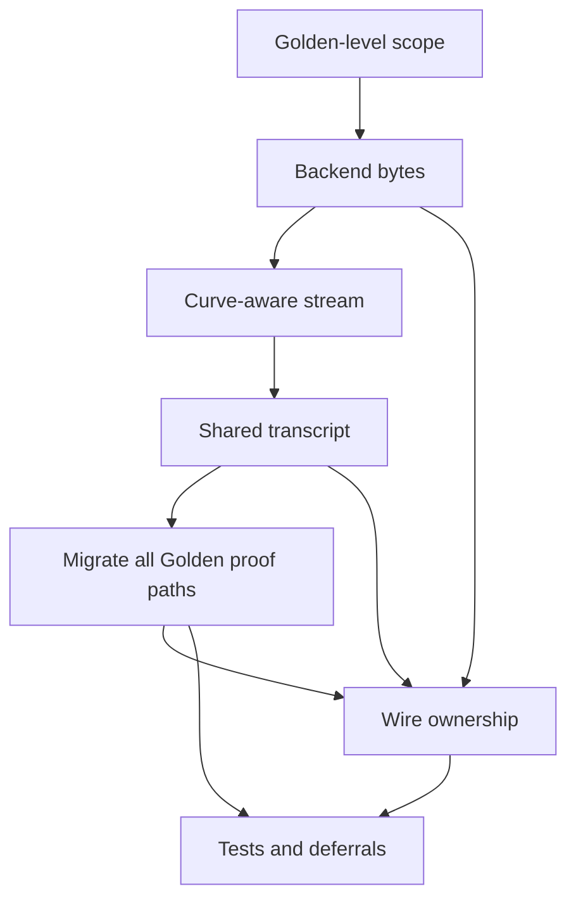

# Golden proof-stream cleanup wayfinder map

**Label:** `wayfinder:map`

## Destination

Produce an implementation-ready spec and ticket set for one PR that removes Golden-level proof container types and associated proof generics, replacing them with curve-aware opaque prover/verifier proof streams using one correctly bound transcript, while preserving current curve configurability, mathematical relations, DKG lifecycle, and EHTDH production semantics.

## Notes

- Planning only; no implementation in this session.
- Branch: `cleanup/dkg-ehtdh`, base `5e161d5`.
- `ice/proof-stream` / `589204d` is an idea source, not a commit to restore.
- The archived Bulletproofs Proof Stream rewrite remains reverted for now. The same concept may move into R1CS/IPP later, building on this Golden-level abstraction.
- Breaking proof bytes, dealer-message bytes, and Golden-level Fiat–Shamir challenges are acceptable because the crates are unpublished.
- `CONTEXT.md`, `README.md`, `comments.md`, `docs/`, and audit resources remain untouched.

## Decisions so far

- [Keep the cleanup at the Golden proof-composition seam](decisions/01-scope-boundary.md) — Preserve current curves, relations, DKG flow, EHTDH behavior, and Bulletproofs implementation.
- [Keep the backend seam but remove its proof type](decisions/02-backend-bytes.md) — `EvrfProofBackend` returns/consumes opaque bytes and identifies its stream grammar with `PROOF_ID`.
- [Make the stream curve-aware](decisions/03-curve-aware-stream.md) — Canonical point/scalar parsing and identity policy live in paired prover/verifier stream roles.
- [Use one shared transcript for every Golden proof phase](decisions/04-shared-transcript.md) — Complete public statements are observed first; every accepted message is absorbed exactly once; nested R1CS uses the same Merlin transcript.
- [Migrate every Golden proof path](decisions/05-migrate-proof-paths.md) — Prototype, standalone one-receiver, and batched dealer proofs all use streams; Golden proof containers disappear.
- [Let the proof stream own proof identity and framing](decisions/06-wire-versioning.md) — `DealerMessage<G>` stores opaque bytes; proof ID is inside the stream header; dealer-message wire becomes v2 with no legacy decoder.
- [Defer the Bulletproofs-internal stream migration](decisions/07-tests-and-deferrals.md) — Current typed `R1CSProof` remains the one nested proof intermediate; tests pin the new Golden stream behavior and future seam.

## Resolved dependency map

## Not yet specified

None. Exact labels, proof IDs, and vector bytes are implementation outputs governed by the versioning decisions, not open architecture questions.

## Out of scope

- Changing Golden curve/group configuration or genericity.
- Correcting or redesigning the current eVRF, prototype, Feldman, or batched mathematical relations.
- Changing beta, hash-to-curve, dealer public fields, statement roots, dealing roots, completion roots, DKG state transitions, or receiver recovery.
- Production changes to EHTDH setup, encryption, decryption, or DKG bridge semantics.
- Any change to `crates/bulletproofs-cycle` in this PR.
- Removing or redesigning `R1CSProof`, IPP proof types, phase markers, or current R1CS byte grammar.
- Runtime proof-backend negotiation or a general proof framework outside Golden.
- Legacy proof/dealer-message decoding.
